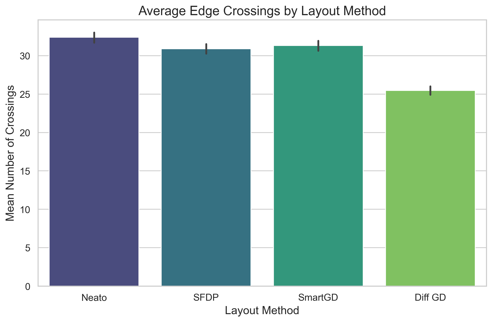
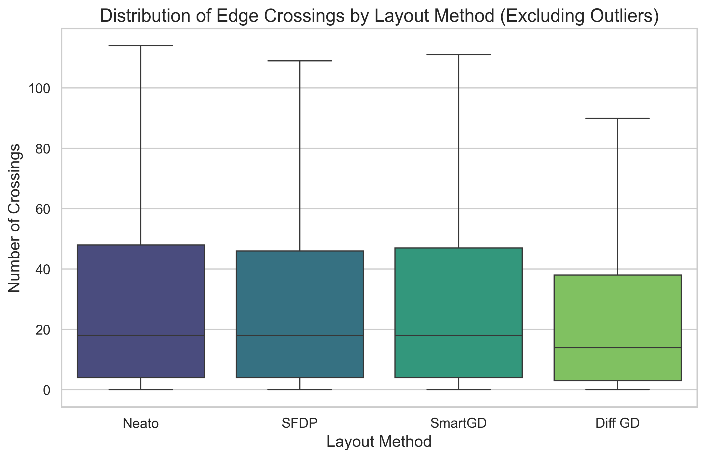

# Graph Layout Optimization with Reinforcement Learning

This project formulations graph layout optimization as a Reinforcement Learning problem, with the primary objective of learning a policy to iteratively minimize the number of edge crossings in graph visualizations.

## Baseline Evaluation

To establish a performance benchmark, we evaluated four different graph layout baselines across 11,534 valid graphs in the `rome` dataset. 

### Baselines Evaluated
1. **Neato:** Graphviz layout minimizing stress.
2. **SFDP:** Scalable Force-Directed Placement via Graphviz.
3. **SmartGD:** Layouts evaluated in the GraphDrawingBenchmark.
4. **Diff GD (Differentiable Crossing Loss + Gradient Descent):** Our custom approach optimizing node coordinates initialized by Neato using stochastic gradient descent (Adam) over 300 epochs with the custom loss function: `XingLoss(soft=True) + 0.2 * StressLoss(G)`.

### Findings

Our Differentiable Crossing Loss + Gradient Descent method significantly reduced the number of crossings on average compared to all standard and benchmarked baselines.

- **Neato Mean Crossings**: ~32.4
- **SFDP Mean Crossings:** ~30.8
- **SmartGD Mean Crossings:** ~31.3
- **Diff GD Mean Crossings:** ~25.4 (Best Performance)

### Visual Benchmarks
The performance comparison of the baseline metrics demonstrates clear improvements using Diff GD.

